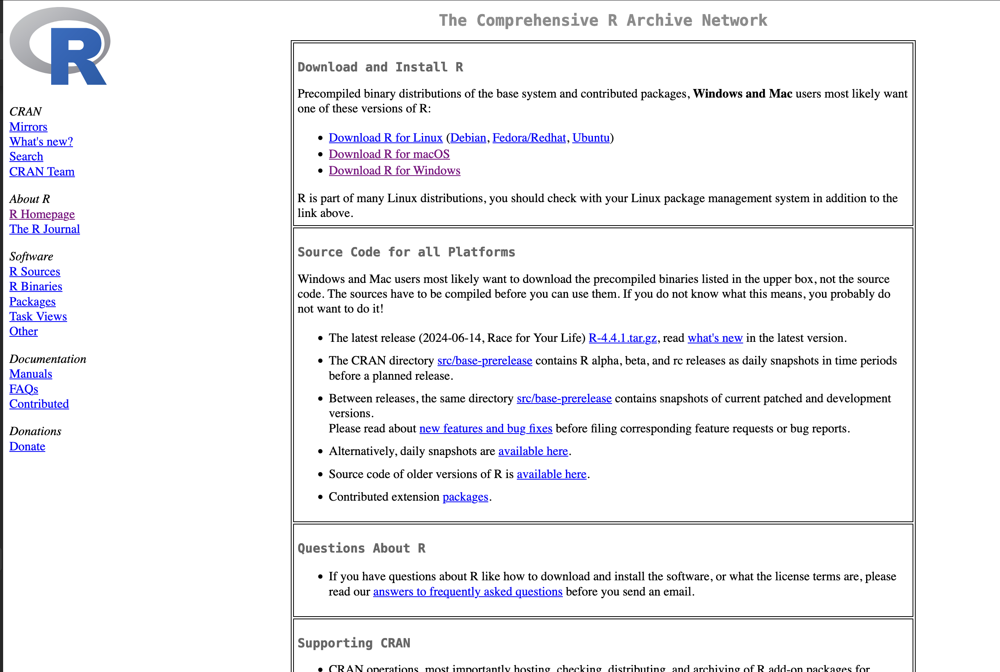
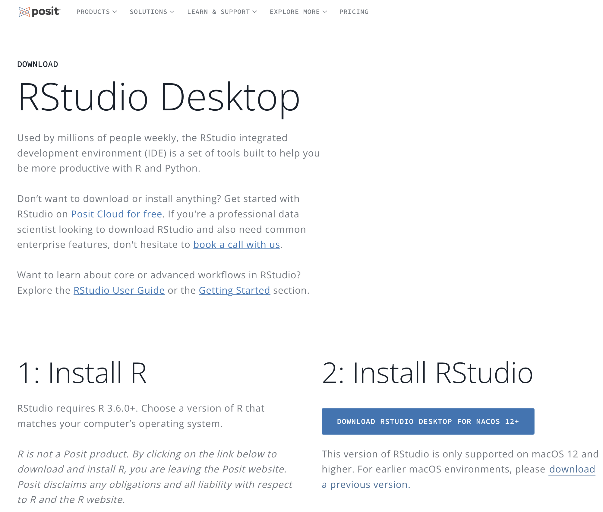
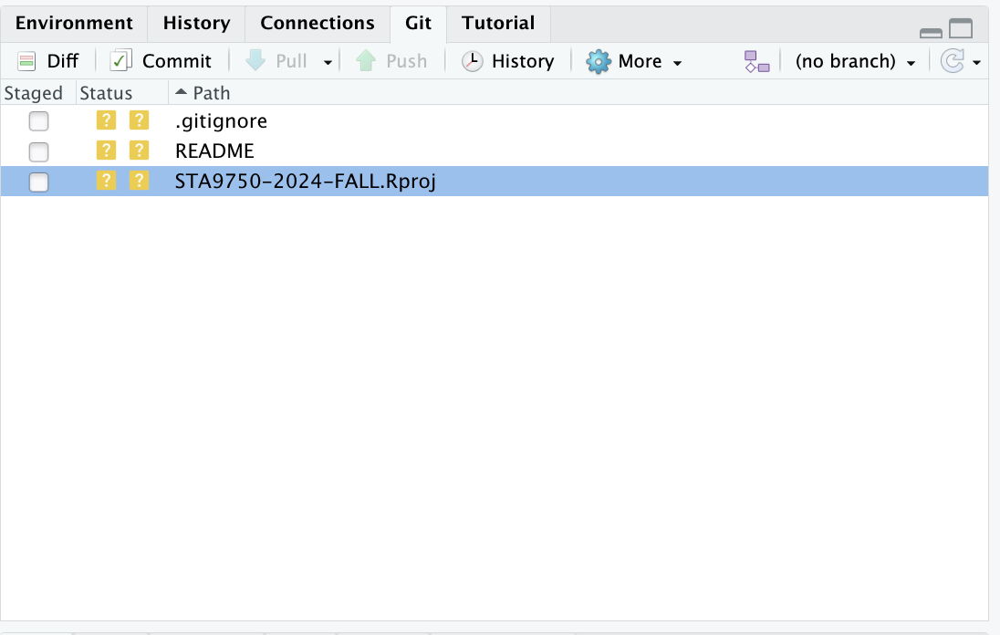
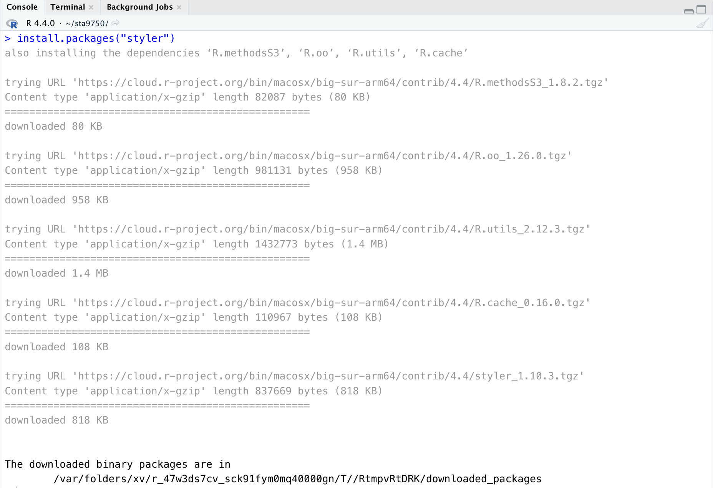

# Welcome!

Topics: 

- Installing `R` and `RStudio`
- Installing `git`
- Getting Started on `GitHub`
- Basic Principles of "Clean Code"

## `R` and `RStudio`

The primary programming language used in this course is `R`, one of the two
most popular languages used in data science. `R`, like its predecessor the
`S` language, is optimized for *interactive*, *data-analytic* work, in contrast
with `python`, which is optimized for general purpose computing. 

`R` is a programming *language* and *runtime*; we will supplement it with `RStudio`, 
an *Integrated Development Environment* or, less formally, an *editor*. `RStudio` 
is the software where you will **write** the code and then the `R` runtime will
**execute** it. 

### `R`

Students should first install `R` from [https://cloud.r-project.org/](https://cloud.r-project.org/).

[](https://vimeo.com/203516510 "R Installation Tutorial!")


As of 2024-08-26, the most recent version of `R` is **4.4.1**. Using the most current
version of `R` will reduce the likelihood of issues later in the course.

### `RStudio`

Next, download and install the [`RStudio` IDE (desktop edition)](https://posit.co/download/rstudio-desktop/).

[](https://vimeo.com/203516968 "RStudio Installation Tutorial!")


`RStudio` is highly configurable and I recommend taking advantage of all its 
built-in features. If you go to the `Global Options` menu (accessible under `Tools`),
I recommend the following settings:

- General: Uncheck "Restore .RData into workspace at startup".
- General: Set "Save workspace to .RData on exit" to "Never"
- Code / Editing: Set "Tab width" to 2
- Code / Editing: Check
  - "Insert spaces for Tab"
  - Auto-detect code indentation
  - Insert matching parens / quotes
  - Use native pipe operator
  - Auto-indent code after paste
  - Vertically align arguments in auto-indent
  - Continue comment when inserting new line
- Code / Display: Check
  - Show line numbers
  - Show margin (margin column should be 80)
- Code / Diagnostics:  check all "R" diagnostics.
- Appearance: Pick a color theme you enjoy. (I'm partial to light text on a dark background)
  
You may wish to enable GitHub Copilot. I have little experience with GH Copilot, 
but it seems quite popular and is allowed in this course. It is not guaranteed to be
accurate at all times - and "the AI told me to" is not a valid excuse if your code is 
wrong - but on balance, it should be useful.

### `quarto`

We won't use it this week, but you will need to install [Quarto](https://quarto.org/docs/get-started/)
before starting on [Mini-Project #00](../miniprojects/mini00.html).

## Source Code Management

### `git`

`git` is a **source-code management** tool, used by developers to manage the code
they write. If you've ever been part of a large project and struggled to coordinate
all team members using the same version of a document, `git` exists to solve that problem.

If you don't have `git` pre-installed, install either [Git for Windows](https://git-for-windows.github.io/) or the XCode Command Line Tools for 
MacOS. If not automatically prompted when you try to use `git`, the Mac install
can be manually triggered by running `xcode-select --install` at a command line.

In this course, we will use three main functions of `git`: 

- **staging**: telling `git`, I want you to prepare to save a certain file
- **committing**: saving a set of related changes
- **pushing**: copying your committed changes to a separate server for sharing and backup

Whenever you write code you are happy with, you should use `git` to save it. Saving
changes with `git` is cheap and easy - so do it regularly. You always want `git`
to have a backup of good code in case you loose power, accidentally delete a file, 
break something in a way you're not sure how to undo, *etc.*. 

`RStudio` comes with powerful `git` integration. Once you have created a _project_, 
you should see a tab labelled "Git" in the top right corner of your IDE window that
looks something like this: 



To **stage** a file - prepare to save it - click the empty check box next to the file name. 
A new file shows a status of "?" - this is `git` saying "I've never seen this file 
before. Do you want me to track it for you?". Later, when you make further changes to file
you have already asked git to track, a status of "M" (for **M**odified) will be shown. 

On its own _staging_ a file does nothing. You also need to _commit_ it for `git` to
truly track it.[^5] The `Commit` button will commit all _staged_ changes. When you 
make a commit, `git` requires a brief message summarizing the changes. There's no
particular formatting requirement to this message, but it should be something that
future-you is able to easily understand. For instance, the commit message from the
initial draft of this document reads as: 

```
Initial draft of Lab 01 (STA9750)

- Installing R and RStudio
- Git and GitHub
- Leaflet Example for Styler

TODO: Fuller shell explainers
TODO: Link more git help
```

When I read this, I know the purpose of the change I made (first line), the
contents of that change (list), and parts that still need more work. 

Finally, after you save a change, it is only saved on your computer. The true power
of `git` comes from its ability to copy changes and backups across machines. This
gives you an easy way to store backups in case your computer dies and makes collaboration
efficient and fun. `git` allows you to `push` and `pull` changes between machines
in endlessly powerful (but sometimes complex) ways. For this course, we'll keep
things simple and only use `GitHub` to share code. We discuss `GitHub` in the next
section.


**Reference**: We will not use all of the functionality of `git` in this course, but
you should familiarize yourself with Chapters 1, 2, and 6 of the [Git Book](https://git-scm.com/book/en/v2)
over the next two weeks.


### `GitHub`

`GitHub` is an industry-standard code hosting and collaboration platform. In addition
to hosting copies of code, `GitHub` provides web hosting, bug reporting, code review, 
continuous integration, documentation wikis, and discussion fora. You will explore
`GitHub` in more detail starting in [Mini-Project #00](../miniprojects/mini00.html).

## Code Styling

### Autoformatting with the `styler` Package

A major theme of this course will be sharing and co-developing code with your
classmates, both for peer feedback and for the course project. Code sharing is hard!
Everyone writes code a little differently and what is clear to you may not be clear
at all to your reader. 

To make code sharing just a bit easier, we use tools to ensure all code shared
in this course is consistently formatted. By using consistent formatting, you
reduce the cognitive load on your reader, making it easier for them to focus on
the *ideas* of your code, not how you chose to write it. 

A major strength of `R` is its huge number of user-contributed *packages*. These are
"add-ins" which provide additional functionality not available in the basic version of `R`. 
As of 2024-08-26, there are over [21 thousand packages](https://cran.r-project.org/web/packages/available_packages_by_name.html) available
on [CRAN](https://cran.r-project.org), the largest official repository of `R` packages. Beyond
all those, there are thousands more packages available on other code hosting
websites like `GitHub`.[^2]

We will use the contributed `styler` package to format code in this course. 
Run the following command to automatically download and install the `styler` package: 


::: {.cell}

:::


(Use the clipboard icon on the right of code snippets to automatically copy code suitable
for pasting into `RStudio`.)

You should see something like this: 



The `styler` package has been downloaded and installed on your computer, but it is not
yet "active" or "open" in `R`. In general, you will only need to _download_ packages
once, but you will need to _load_ them each time you want to use them.[^3]

Open a `R` file in `RStudio` and copy the following (ugly) code: 


::: {.cell}

:::


You don't need to understand what this does just yet, but it's hopefully clear that
this is _ugly_ code. Nothing is lined up properly, capitalization is erratic, 
and different coding styles are intermixed rather recklessly. 

Near the top of your `RStudio` pane, you will see a drop-down menu titled `Addins`. 
If you successfully installed `styler` above, one of the `Addins` choices will be
"style active file." Click this and the code will be cleaned up (a bit) resulting
in something like this: 


::: {.cell}

:::


It's far from perfect - and we will discuss the *many* issues in this example throughout
the course - but it's better! At a minimum, you should make sure to run `styler`
like this on all code you submit during this course. 

And now that your code is cleaned up, you should run it! The `Source` button in the top
right corner will run all code in the open file. Running the code produces something
like this: 


::: {.cell}
::: {.cell-output-display}


```{=html}
<div class="leaflet html-widget html-fill-item" id="htmlwidget-8eb379c330e62f6363a5" style="width:960px;height:480px;"></div>
<script type="application/json" data-for="htmlwidget-8eb379c330e62f6363a5">{"x":{"options":{"crs":{"crsClass":"L.CRS.EPSG3857","code":null,"proj4def":null,"projectedBounds":null,"options":{}}},"calls":[{"method":"addTiles","args":["https://{s}.tile.openstreetmap.org/{z}/{x}/{y}.png",null,null,{"minZoom":0,"maxZoom":18,"tileSize":256,"subdomains":"abc","errorTileUrl":"","tms":false,"noWrap":false,"zoomOffset":0,"zoomReverse":false,"opacity":1,"zIndex":1,"detectRetina":false,"attribution":"&copy; <a href=\"https://openstreetmap.org/copyright/\">OpenStreetMap<\/a>,  <a href=\"https://opendatacommons.org/licenses/odbl/\">ODbL<\/a>"}]},{"method":"addPopups","args":[40.74027777777778,-73.98333333333333,"Look! It's <b>Baruch College<\/b>!",null,null,{"maxWidth":300,"minWidth":50,"autoPan":true,"keepInView":false,"closeButton":true,"className":""}]}],"setView":[[40.74027777777778,-73.98333333333333],17,[]],"limits":{"lat":[40.74027777777778,40.74027777777778],"lng":[-73.98333333333333,-73.98333333333333]}},"evals":[],"jsHooks":[]}</script>
```


:::
:::


Not too shabby! That's an *interactive*, *dynamic* map showing the location of Baruch College obtained
by parsing the [Baruch Wikipedia page](https://en.wikipedia.org/wiki/Baruch_College), 
getting the GPS coordinates of Baruch, downloading a map file, and locating Baruch on that
map. 

**Challenge**: Adjust this code to show _Hunter_ college instead of Baruch.

### `lintr` 

If you want even more feedback on writing good code, install the `lintr` package
and use the associated `RStudio` add-in. Unlike `styler`, `lintr` won't make changes
_automatically_ for you, but it will highlight much more subtle _possible_ problems.[^6]

## Extra: Welcome to $SHELL

To become a true "power user" of tools like `R` and `python`, you will need to 
become more familiar with the command line interface (CLI) and associated tools.[^4]

The [Software Carpentry Unix Shell Tutorial](https://swcarpentry.github.io/shell-novice/aio.html)
is a great introduction to shell usage. Check it out!

**NB**: MacOS and Linux systems work quite similarly under the hood, as both descend
from the `Unix` tradition. By contrast, Windows works somewhat differently. Learners
whose personal machine runs Windows are encouraged to take advantage of the provided
Linux-running virtual machines[^1] as they work through this section.

<!--
### Text Files

> Perfection is achieved, not when there is nothing more to add, but when there is nothing left to take away. - Antoine de Saint-Exupéry, Airman's Odyssey 

### Terminal Velocity

### File System

-->

## Looking Ahead

Next week, we will use these tools to begin coding in earnest. If you're feeling
ambitious, go ahead and get started on [Mini-Project #00](../miniprojects/mini00.html).

[^1]: See the [Course Resources](../resources.html) page.

[^2]: If you are interested in bioinformatics, the [Bioconductor](https://www.bioconductor.org/)
project develops incredible open-source `R` packages.

[^3]: While this may feel cumbersome, it's really not dissimilar to any other
software you use (or `R` itself). You need to download it once, but you need to
open it each time you intend to use it. There's no harm in re-downloading--free software!--but
it wastes time and bandwidth. Since we benefit so much from the free-software community,
the very least we can do is not run up their internet bills unnecessarily. 

[^4]: As an added benefit, use of the CLI also makes you look like a 90s movie hacker to all
your friends.

[^5]: This two stage process is a bit cumbersome for the first stage of a small project, 
but it quickly becomes incredibly valuable. Instead of saving _everything_ every time, 
there is great power in only saving "good" or "finished" changes to a large project,
while leaving work-in-progress elsewhere unsaved. You probably won't need this level
of control until you get to the course project, but it's better to have it than not.

[^6]: Some of the issues identified by `lintr` may be _false positives_, but the 
false positive rate is quite low, especially for the sort of procedural code that
is the focus of this course. You should default to trying to appease `lintr`, but
feel free to use the course discussion board for any questions.
