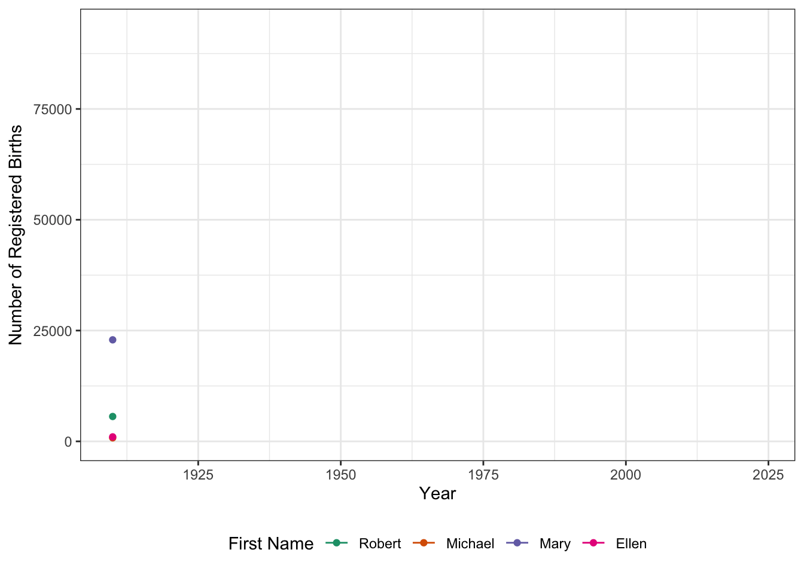



```{r}
#| echo: false
#| eval: false
# Make sure that figure path respects my directory structure
# This seems to be important for gganimate + quarto
knitr::opts_hooks$set(fig.path = function(options){
  dirname_input <- dirname(knitr::current_input(TRUE))
  
  options$fig.path <- file.path(dirname_input, 
                                options$fig.path)

  options
})
```

This week, we will dive deeper into the world of data visualization, briefly
introducing three important topics: 

- mapping; 
- animated visualizations; and
- interactivity. 

Before getting into the new stuff, let's pause and consolidate everything we've 
done to date: 

1. If you did not finish [our previous in class plotting
   activities](../labs/lab06.qmd), please do so now.

2. Explore the [R Graphics Gallery "Best Charts"
   collection.](https://r-graph-gallery.com/best-r-chart-examples)
   Pick one chart from this collection and evaluate it with a critical
   eye:
   
   i) Is it well styled?
   ii) What story is it trying to tell?
   iii) Does it tell that story effectively?
   iv) Do you believe that story? 
   v) How could it tell the story more effectively?
   
After doing that, we're ready to move on to new material. First let's make
sure that you have all the necessary software installed. 

## Software Checks

This upcoming week, we will use several new `R` packages. These packages depend 
on  additional software external to `R`; while this is not typically an issue, 
and `R` attempts to install these additional libraries "auto-magically" for you,
issues do occasionally arise. In preparation for class, I recommend that you
attempt to install these additional libraries so that you will be able to easily
follow along in class. 

In particular, there are three `R` packages you should install and confirm work
as expected: 

1. `sf` - A library for working with geospatial data
2. `gganimate` - A library for producing _animated_ graphics. 
3. `shiny` - A library for interactive dashboard creation

I provide code to install and run a small example of each software below. If
you can run all of these without issue, you should be good to go. (You do not
need to _understand_ this code just yet, but you are welcome to work through it.)
If you have issues installing this software, please reach out for help on the
course discussion board or in office hours. 

### `sf`

The `sf` library provides a unified interface for manipulating geospatial
data. We will primarily use it for visualizing _spatial_ data, *i.e.*, maps.

`sf` depends on several other packages, so we will make sure these are
all installed as needed: 

```{r}
ensure_package <- function(pkg){
    pkg <- as.character(substitute(pkg))
    options(repos = c(CRAN = "https://cloud.r-project.org"))
    if(!require(pkg, character.only=TRUE, quietly=TRUE)) install.packages(pkg)
    stopifnot(require(pkg, character.only=TRUE, quietly=TRUE))
}
ensure_package(sf)
```

Once these packages have been installed, run the following code to confirm
correct installation. 

```{r}
#| fig-asp: 0.3
library(sf)
library(ggplot2)
system.file("shape/nc.shp", package = "sf") |>
    sf::st_read(quiet=TRUE) |>
    ggplot(aes(geometry=geometry, 
               fill=NAME)) + 
      geom_sf() + 
      guides(fill="none")
```

This should produce a multi-colored map of North Carolina. 


### `gganimate`

The `gganimate` package can be used to create _animated_ graphics. To do so,
it generates a series of `png` files using "standard" `ggplot2` and then
invokes an external library to combine those `png` files into a `gif`. 
The simplest tool for the `png`-to-`gif` transformation is called `gifski`,
so we will try to install it first:

```{r}
ensure_package <- function(pkg){
    pkg <- as.character(substitute(pkg))
    options(repos = c(CRAN = "https://cloud.r-project.org"))
    if(!require(pkg, character.only=TRUE, quietly=TRUE)) install.packages(pkg)
    stopifnot(require(pkg, character.only=TRUE, quietly=TRUE))
}
ensure_package(gifski)
ensure_package(gganimate)
```

Once installed, please run the following command to verify your installation
was successful. 

```{r}
#| results: 'hide'
#| message: false
library(tidyverse)
library(gganimate)

readr::read_csv("https://michael-weylandt.com/STA9750/labs/ssa_babynames.csv.gz") |>
    filter(name %in% c("Mary", "Ellen", "Robert", "Michael")) |>
    summarize(n = sum(number), .by=c("year", "name")) |> 
    mutate(name=factor(name, 
                       levels = c("Robert", "Michael", "Mary", "Ellen"))) |>
    ggplot(aes(x=year, y=n, color=name)) + 
    geom_point() +
    geom_line() + 
    theme_bw() + 
    theme(legend.position='bottom') +
    xlab("Year") + 
    ylab("Number of Registered Births") + 
    scale_color_brewer(type="qual", palette=2, name="First Name")  + 
    transition_reveal(year) 
```

```{r}
#| echo: false
anim_save("pre/pa08_ssa.gif")
fs::file_copy("pre/pa08_ssa.gif",
              "docs/pre/pa08_ssa.gif", 
              overwrite=TRUE)
```



This should create a moving line plot showing the number of children born each year with certain names. 

### `shiny`

The following script will install `shiny`: 

```{r}
ensure_package <- function(pkg){
    pkg <- as.character(substitute(pkg))
    options(repos = c(CRAN = "https://cloud.r-project.org"))
    if(!require(pkg, character.only=TRUE, quietly=TRUE)) install.packages(pkg)
    stopifnot(require(pkg, character.only=TRUE, quietly=TRUE))
}
ensure_package(shiny)
```

Once `shiny` is installed, confirm that it works as desired by 
running the  following code: 

```{r}
#| eval: false
library(shiny)
shinyApp(
    ui = fluidPage(
      numericInput("n", "n", 10, min=3, max=30),
      plotOutput("plot")
    ),
    server = function(input, output) {
      output$plot <- renderPlot(plot(rnorm(input$n)) )
    }
  )
```

If this works, it will bring up a very simple window where you can enter 
a number and see that many random points plotted. 

```{shinylive-r}
#| standalone: true
#| echo: false
#| viewerHeight: 420
library(shiny)
library(shinylive)
shinyApp(
    ui = fluidPage(
      numericInput("n", "n", 10, min=3, max=30),
      plotOutput("plot")
    ),
    server = function(input, output) {
      output$plot <- renderPlot(plot(rnorm(input$n)))
    }
  )
```

Note that this might take a while to load in the browser; the version that
appears when you run the code locally should be rather quick.

## Spatial Data Manipulation

Above, when testing `sf`, we created a map of North Carolina. Let's now take a
closer look at what the plotted data actually entailed: 

```{r}
nc <- system.file("shape/nc.shp", package = "sf") |>
    sf::st_read(quiet=TRUE)
nc
```

Here, `nc` is a `r class(nc)[1]` object: this is a _subclass_ (specialized 
version) of a data frame that includes spatial information. If we `glimpse()`
the object, we see that most of our columns are as expected, but the `geometry`
column is unlike anything we've seen so far: 

```{r}
library(tidyverse)
glimpse(nc)
```

Here the `geometry` column is of type `MULTIPOLYGON` and if we look a bit
closer at what that means, we see that each cell (so each single 'data point')
looks something like this: 

```{r}
#| echo: false
nc$geometry[[1]]
```

This is a list of GPS coordinates which can be traced out
to give the shape of a _polygon_. In this particular case,
the first row of the `nc` object is [Ashe County, NC](https://en.wikipedia.org/wiki/Ashe_County%2C_North_Carolina) and the multipolygon is structured as: 

```{r}
#| echo: false
nc1 <- nc$geometry[[1]]
ggplot() + 
  geom_sf(data=nc1, fill="lightblue", alpha=0.5) + 
  geom_sf(data=st_cast(nc1, "MULTIPOINT"), color="red", size=2) + 
  theme_minimal() + 
  ggtitle("Ashe County NC - Polygon Boundary and Vertices")
```

As you see, this forms a closed shape with linear sides, *i.e.*, a polygon. 
(Look back at that list of GPS coordinates above: it starts and ends in 
the same place.)

So why is this called a **multi**polygon? Well, not all
geographic regions are true *contiguous* polygons. [Dare County,
NC](https://en.wikipedia.org/wiki/Dare_County,_North_Carolina) contains some of
NC's famous *Outer Banks* islands. 

```{r}
#| echo: false
nc2 <- nc |> filter(NAME == "Dare") |> pull(geometry)
ggplot() + 
  geom_sf(data=nc2, fill="lightblue", alpha=0.5) + 
  geom_sf(data=st_cast(nc2, "MULTIPOINT"), color="red", size=2) + 
  theme_minimal() + 
  ggtitle("Dare County NC - Polygon Boundary and Vertices")
```

As you can see, this isn't a super-high resolution boundary file, but it does
pick up on the existence of several islands. Because this geographic unit is
divided into several polygons, it is indeed a *multipolygon*. 

You're probably starting to think that spatial data can be quite complicated - 
and you're right! Programmatically dealing with geospatial data can require
highly sophisticated GIS ("Geographic Information System") tools, but we can
cover the easy 80% of spatial data manipulation using `R`'s `sf` package. 

`sf` or "Simple Features for `R`" integrates the [simple features GIS
paradigm](https://en.wikipedia.org/wiki/Simple_Features) into an `R` `tidyverse`
framework. We'll run through some basic examples here to help get you started.

To make our intro a bit more concrete, let's bring it home to NYC. We'll load
up three different spatial data sets: 

1) The NYC subway lines: 

```{r}
#| message: false
library(sf)
subway_lines <- st_read("https://data.ny.gov/resource/s692-irgq.geojson", 
                        quiet=TRUE)
```

2) The NYC subway stations: 

```{r}
#| message: false
subway_stations <- st_read("https://data.ny.gov/resource/39hk-dx4f.geojson", 
                           quiet=TRUE) |>
  select(-borough) # We're going to use borough as an example later so drop
```

3) NYC borough boundaries and populations

```{r}
#| echo: false
options(tigris_use_cache=TRUE)
```

```{r}
library(tidycensus)
nyc_tracts <- get_acs(
  geography = "tract",
  variables = "B01003_001", 
  state = "NY",
  county = c("New York", "Kings", "Queens", "Bronx", "Richmond"),
  geometry = TRUE,
  year = 2024) |>
  mutate(borough = case_when(
    str_detect(NAME, "Queens County") ~ "Queens", 
    str_detect(NAME, "Kings County") ~ "Brooklyn", 
    str_detect(NAME, "Bronx County") ~ "Bronx", 
    str_detect(NAME, "Richmond County") ~ "Staten Island", 
    str_detect(NAME, "New York County") ~ "Manhattan",
    .unmatched="error"
  )) |>
  rename(population = estimate) |>
  select(-GEOID, -variable, -moe) |>
  st_transform(crs=4326) # We'll talk about this in class
```

Let's compare these three data sets: 

1)  `nyc_tracts` has a `MULTIPOLYGON` geometry, as we would expect for 
    [NYC's Census Tracts](https://data.cityofnewyork.us/City-Government/2020-Census-Tracts-Mapped/weqx-t5xr). 
   
    ```{r}
    glimpse(nyc_tracts)
    ```
    
2)  NYC's Subway Stations have a `POINT` geometry type since they exist at a
    single point in space, not as a region.[^station]
    
    ```{r}
    glimpse(subway_stations)
    ```
    
3)  Finally, the subway _lines_ have type `MULTILINESTRING`. This is a bit of
    a mouthful, but it captures the essence of how we would expect subway lines
    to be: one-dimensional paths traced on a 2D background. 
    
    ```{r}
    subway_lines
    ```
    
So we have three types of data: point (stations), linear (subway lines), and 
areal (census tracts). The complexity of GIS work comes from combining these. 
First, let's plot them. In each case, all we have to do is use the `geom_sf()`
function from `ggplot2` with the `geometry` aesthetic and `R` will handle it
properly for us:[^water_tracts]

[^water_tracts]: You might notice that the census provided tract shapes
include some water parts of NYC so we're not actually getting the
expected East River between Manhattan/Bronx and Brooklyn/Queens. NYC
Planning provides [a shoreline clipped
shapefile](https://www.nyc.gov/content/planning/pages/resources/datasets/census-tracts) but then we'd have to match things up with the census
data, so we're not going to worry about the water for now.

```{r}
nyc_tracts |> 
  ggplot(aes(geometry=geometry)) + 
  geom_sf() + 
  theme_bw() + 
  ggtitle("NYC Census Tracts [Areal geom_sf]")
```


*vs.*

```{r}
subway_stations |> 
  ggplot(aes(geometry=geometry)) + 
  geom_sf() + 
  theme_bw() + 
  ggtitle("NYC Subway Stations [Point geom_sf]")
```

and

```{r}
subway_lines |> 
  ggplot(aes(geometry=geometry)) + 
  geom_sf() + 
  theme_bw() + 
  ggtitle("NYC Subway Lines [Linear geom_sf]")
```

We can even superimpose these: 

```{r}
ggplot(mapping=aes(geometry = geometry)) + 
  geom_sf(data=nyc_tracts) + 
  geom_sf(data=subway_stations, col="red4") + 
  geom_sf(data=subway_lines, col="green3", alpha=0.8) +
  theme_bw()  + 
  ggtitle("NYC Subway System")
```

Note that here, instead of setting the `data` for the whole plot 
in the initial `ggplot()` call as we typically do, we have passed
different data sets to each _layer_ of the plot. 

So let's do some basic manipulation. First, we might want to _aggregate_ tracts
to boroughs and get borough-level populations: 

```{r}
nyc_tracts |> 
  group_by(borough) |> 
  summarize(population = sum(population))
```

We see here that we summed the population as we might expect, but what happened
to the `geometry` column? Because this was an `sf` and not a "regular" 
`data.frame`, the spatial nature _persisted_ across summarization. Here, we see
that the geometry column is essentially the _union_ of all the tracts in that 
borough: 

```{r}
nyc_tracts |> 
  group_by(borough) |> 
  summarize(population = sum(population)) |>
  ggplot(aes(geometry=geometry)) + 
  geom_sf()
```

Pretty nifty. Our other `dplyr` operations work as we might expect: 

```{r}
nyc_tracts |> 
  group_by(borough) |> 
  slice_max(population) |>
  ggplot(aes(geometry=geometry, fill=borough)) + 
  geom_sf() + 
  theme(legend.position="bottom") + 
  ggtitle("Most Populous Tracts in Each Borough")
```

Not terribly attractive, but it does what we'd expect. 

Things get more interesting when we want to _combine_ different bits of 
geometry. For example, suppose we want to ask "how many subway stations are in
each borough?" (Poor Staten Island...) To answer this, we want to do a 'join', 
but it's not quite one of the equality joins we used from normal `dplyr`. 

We need a _spatial_ join, which is implement with the `sf::st_join()` function. 
And instead of using a `join_by(x == y)` type specification, we need to use
one of the relevant logical predicates listed [on the help page](https://r-spatial.github.io/sf/reference/st_join.html). For us, the 
default `st_intersects` seems to work just fine: 

```{r}
library(gt)
st_join(subway_stations, nyc_tracts) |>
  group_by(borough) |> 
  count() |> 
  arrange(desc(n)) |> 
  gt(id="tbl_subway1") |> 
  cols_hide("geometry") |> 
  cols_label(borough = md("**Borough**"), 
             n="Number of Subway Stations") |>
  grand_summary_rows(columns=n, 
                     fns=list("Total" ~ sum(.)))
```

This is perhaps a bit fishy - why are there 21 stations in SI which 
(famously) does not have a subway. We should always start by seeing if our 
join went off, but things look good here. We have 496 rows, which matches
the 496 rows in `subway_stations`. It turns out this is just a good-old 
"data not being what the label makes us think" problem: 

```{r}
st_join(subway_stations, nyc_tracts) |> 
  filter(borough == "Staten Island") |>
  gt() |>
  cols_hide(everything()) |> 
  cols_unhide(c(stop_name, line, division, borough)) |>
  cols_merge(c(line, division)) |>
  cols_label(stop_name = "Stop Name", 
             line="Line", 
             borough="Borough")
```

So it seems the Staten Island Railroad is listed as a subway on the
official [MTA Subway Stations listing](https://data.ny.gov/Transportation/MTA-Subway-Stations/39hk-dx4f/about_data). Ain't life grand?

There is _much_ more that can be said about spatial data, but these are
the basic tools and all that we have time for now. If you have questions about
using spatial techniques in your course project, please ask!
    
[^station]: Of course, the stations are not actually *true* points (in the sense
of geometry) and have an extent and a shape, but we treat them as points for
this exercise. 

## Getting Started with Shiny

This week, we will also explore various technologies for interactive data 
visualization. These can be divided into two broad categories: 

- Server Based: When the user makes a change to a plot, it is sent to a 
  server where the new plot is rendered and returned to the user. 
- Browser Based: When the user makes a change to a plot, the new plot is 
  created _in the browser_ and re-rendered 'on site'. (This is the strategy
  I have used through some of these notes, where you are able to type `R` code
  and run it directly in your browser.)
  
Generally, server-based approaches are more flexible and a bit easier to 
implement, while browser-based approaches are more responsive and scalable.
Since the browser work is done locally on the user's computer (or phone or 
tablet), they are also cheaper and safer to run as there's no need to have
a server constantly responding to user input. 

This week, we will explore _a bit_ of each modality, though entire courses
(and indeed entire careers) have been spent on both. 

In the `R` ecosystem, the tool of choice for building server-based[^slive] web
applications is `shiny`.[^py] **For this pre-assignment, work through 
Lessons 1 and 2 of the ["Shiny 
Basics"](https://shiny.posit.co/r/getstarted/shiny-basics/lesson1/) 
web tutorial.** (You do not need to do the "Next Steps" in Lesson 3, but you are
of course welcome to.)

[^slive]: There is an effort to run `shiny` fully in browser (avoiding the need
for a web server). It is still a work-in-progress, but you can try it out on
the [`r-shinylive`](https://posit-dev.github.io/r-shinylive/) website, with
a full gallery of examples [here](https://shinylive.io/r/examples/). 

[^py]: If you are more of a Python person, you can also check out the Python
versions of [`shiny`](https://shiny.posit.co/py/) and
[`shinylive`](https://shiny.posit.co/py/docs/shinylive.html).

After finishing these activities, complete the Weekly Pre-Assignment Quiz on
Brightspace.

## Optional Enrichment: "Myth Busting and Apophenia in Data Visualization"

For some optional extra enrichment, watch [Prof. Di
Cook](https://www.dicook.org/)'s lecture "Myth busting and apophenia in data
visualisation: is what you see really there?". As we discussed in class, plots 
are an excellent way to explore data, but we always want to be careful that what
we think find *truly exists*. For purely numeric summaries, we can often
avoid (or at least minimize the frequency) of self-delusion with classical
$p$-value-type techniques, but these are not so easily applied to visualization.

Prof. Cook discusses relationships between effective statistical visualization
and effective statistical practice.



