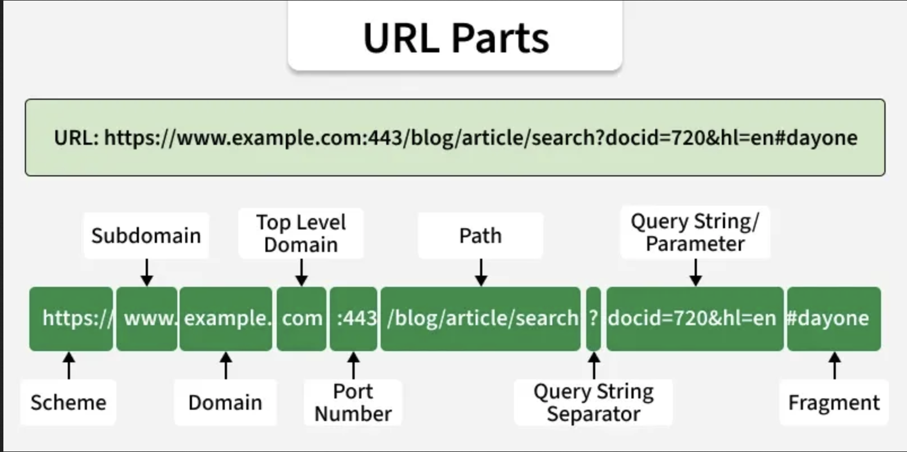



##  Week  

Today: `r TODAY_TOPIC`

. . . 

::: {.smaller}

- Communicating Results (`quarto`)  ✅
- `R` Basics  ✅
- Data Manipulation in `R`  ✅
- Data Visualization in `R`  ⬅️
- Getting Data into `R` ⬅️
  - Files and APIs  ⬅️
  - Web Scraping
  - Cleaning and Processing Text
- Statistical Modeling in `R`

:::


##  Week  

Today: `r TODAY_TOPIC`

::: {.small}

- Course Administration
- Warm-Up Exercises
- Using the File System 
- How The Web *Actually* Works
- JSON and APIs
- Wrap-Up

:::

# Today

## Today

- Course Administration
- Warm-Up Exercise
- New Material
  - Files and the File System
  - HTTP and Web Access
  - API Usage
- Wrap-Up
  - Life Tip of the Day

# Course Administration

## Mini-Project #03

[MP#03](../mini/mini02.html) - `r get_mp_title(3)`

**Due `r get_mp_deadline(3)`**

. . . 

Topics covered: 

::: {.incremental .smaller}

- Data Import
  - Using Published Packages (`tidycensus`)
  - Downloading and Parsing Static Files
  - Using APIs
- Data Manipulation

:::

## Course Support

- Synchronous: MW Office Hours 2x / week: 
  - **Wednesdays 5pm** in-person
  - **Thursdays 5pm** on Zoom
- Asynchronous: Piazza

## Future Mini-Projects

- MP#04: `r get_mp_title(4)`
  - Deadline: `r get_mp_deadline(4)`
  - Web Parsing (`Olympedia`) to predict the 2028 Olympics
  
Already posted - subject to minor revisions before `r get_mp_assigned(4)`

## Course Project

[Course Project](../project.html) should be your *main focus* for rest of course

- You have received second round of feedback from me
- Starting with the tools of today, you can import data into `R` for EDA
  - Next two weeks will dive deeper into data *cleaning* and *preparation*

But you still need to do other mini-projects and pre-assignments(!)

# Review Exercise

## Flat / Plain Text Files

'Plain text' files:

::: {.incremental}

- Simple _human readable_ and _human writeable_ file formats
- Not specific to one piece of software
- Examples: `.csv`, `.txt`, `.tsv`
- Anti-Examples: `.docx`, `.pdf`, `.jpg`
- Line isn't 100% clear

:::

. . . 

Import into `R` with `read*` functions (*e.g.*, `readr::read_csv` )

## SSA Baby Names

From [the US Social Security Administration](https://www.ssa.gov/OACT/babynames/index.html) 
Baby Names records: 

- State, Sex, Name, Number Born

. . . 

Read into `R` (`readr::read_csv`) and make plots to answer various questions: 

1) How popular is the name "Michael" in NY?
2) Are *Mary*s becoming less common in the past decade?
3) Did *Juan* and *Jose* become popular names at the same time?

## Breakout Rooms {.scrollable}

::: {.smaller}

```{r}
#| echo: false
BREAKOUT_TABLE
```

:::

Review activities from [today's lab](`r url_full`#review)

# Files and the File System

## Files and the File System

The _file system_ is the way your computer organizes and provides access to files: 

::: {.incremental}

- Tree like-structure: 
  - Files in folders in folders in folders ... 
    - Separated by `/`
    - *e.g.* `/data/mp01/data_file.csv`
  - End point (or starting point) is the _root_: 
    - Called `/` on Mac/Linux
    - Drive name on Windows (`C:/`)
  
:::

## Home Directory

Typically, all user files are stored in a "home directory": 

::: {.incremental}

- `/Users/YOURNAME` on Mac/Linux
- `C:/Users/YOURNAME` on Windows
- Subfolders include `Downloads`, `Desktop`, `Documents`, *etc*
- Commonly abbreviated as `~`
  - My desktop is `~/Desktop`
  - My general course material is in `~/STA9750`
  - Semester specific material is in `~/`
  
:::

## Paths

Two ways to specify a file: 

::: {.incremental .smaller}

- Absolute path:
  - Starts from root and gives "full name"
  - `/Users/michaelweylandt/STA9750/docs/index.html`
  - GPS coordinates
- Relative path: 
  - Starts from _working directory_ (`getwd()`) and gives directions
  - If I am in `STA9750`, path is just `docs/index.html`
  - `./`  means "this directory": could also write `./docs/index.html`
  - `../` means "up one level"
    - If I were in `STA9750/docs`, source at `../index.qmd`
  - Driving directions
  
:::

## Using the File System in R

Use the `fs` package to interact with the file system: 

::: {.incremental}

- `dir_ls()`, `dir_create()`, `dir_exists()`, `dir_delete()`
- `path()`, `path_home()`, `path_abs()`, `path_rel()`
- `file_create()`, `file_exists()`, `file_delete()`, `file_info()`

:::

## Activity #01

Return to breakout rooms to practice file system usage: 

- Convert relative paths to absolute paths
- List files in a directory
- Examine metadata the largest file(s) in your ``
  directory

# Accessing Data from the Web: URLs, HTTP, JSON

## URLs

URLs are an extension of file paths for the internet: 

::: {.incremental}

- Protocol / Scheme: _How_ data should be transferred
  - HTTP(S), SMS (Texting), POP3/IMAP (Email)
- Domain: Name of the other computer
  - In practice, often a 'placeholder' for something more complex
- Path: Files on the other computer
  - In practice, hide functionalty behind file-like paths
  
:::

## URLs

From `geeksforgeeks.org`

{width="60%" fig-align="center"}

## Static Data Transfer

`R`'s basic `download.file` can be used for downloading simple files:

::: {.small}

```{r}
args(download.file)
```

:::

Basic file download capabilities: 

- `url`: source
- `destfile`: where on your computer to store it

. . .

::: {.smallest}

Customizable behavior, but defaults often work well: 

- `method`: what software to use in the background to download
- `mode`: is this a text or binary file
- `cacheOK`: are you ok with a cached version of the file
- `headers`: do you need to send any additional info in your request

:::

## download.file()

```{r}
#| eval: false
download.file("https://raw.githubusercontent.com/michaelweylandt/STA9750/refs/heads/main/births.csv", 
              destfile="births.csv")
```

Note use of _relative_ path here, so saves in current working directory

. . . 

Be polite: 

- Try to avoid unnecessarily downloading files
- Save file and only download if `!file_exists(destfile)`

## Data Transfer - download.file()

```{r}
#| eval: false
if(!file_exists("births.csv")){
    download.file("https://raw.githubusercontent.com/michaelweylandt/STA9750/refs/heads/main/births.csv", 
                  destfile="births.csv")
}

read_csv("births.csv")
```

## JSON

`JSON`:

- Short for `JavaScript Object Notation`
- Popular plain-text representation for hierarchical data. 
- Closer to Python objects (`dict`s of `dict`s of `dict`s) than `R` `data.frame`s
- *Widely* used for web-based data transfer

## JSON

Example: 

```
{
    "data": {
        "id": 27992,
        "title": "A Sunday on La Grande Jatte — 1884",
        "image_id": "1adf2696-8489-499b-cad2-821d7fde4b33"
    },
    "config": {
        "iiif_url": "https://www.artic.edu/iiif/2",
    }
}
```

## JSON

Read JSON in `R` with `jsonlite` package (alternatives exist)

```{r}
library(jsonlite)
# A JSON array of primitives
json <- '["Mario", "Peach", null, "Bowser"]'

# Simplifies into an atomic vector
fromJSON(json)
```

## JSON

```{r}
json <-
'[
  {"Name" : "Mario", "Age" : 32, "Occupation" : "Plumber"}, 
  {"Name" : "Peach", "Age" : 21, "Occupation" : "Princess"},
  {},
  {"Name" : "Bowser", "Occupation" : "Koopa"}
]'
mydf <- fromJSON(json)
mydf
```

## JSON - A Web Standard

```{r}
#| cache: true
fromJSON("https://official-joke-api.appspot.com/random_joke")
```

Compare to [browser access](https://official-joke-api.appspot.com/random_joke)

## Data Transfer: HTTP

HTTP

- HyperText Transfer Protocol
- Most common (but not only) internet protocol
- Also `ftp`, `smtp`, `ssh`, ... 

"Low-level" mechanism of internet transfer

- Many `R` packages add a friendly UX
- `httr2` for low-level work (today)

## HTTP

<style>
.container{
    display: flex;
}
.col{
    flex: 1;
}
</style>


HTTP has two stages: 

::: {.container}

:::: {.col}

- Request
  - URL (Host + Path)
  - Method (VERB)
  - Headers
  - Content
  - Cookies
::::

:::: {.col}
- Response
  - Status Code
  - Headers
  - Content
  
::::

:::
  
Modern (easy) APIs put _most_ of the behavior in the URL

## HTTP in the Browser

In Firefox: Right-Click + `Inspect`

In Chrome: Right-Click + `Developer Tools`

. . . 

[Mozilla Developer Network (MDN) Docs for HTTP](https://developer.mozilla.org/en-US/docs/Web/HTTP)

## HTTP with httr2

`httr2` (pronounced "hitter-2") is *low-level* manipulation of
HTTP. 

```{r}
library(httr2)
request(example_url())
```

Pretty simple so far: 

- `example_url()` starts a tiny local web host
- `127.0.0.1` is `localhost`

## httr2 Requests

Build a request: 

- `request`
- `req_method`
- `req_body_*`
- `req_cookies_set`
- `req_auth_basic` / `req_oauth`

## httr2 Requests

Behaviors: 

- `req_cache`
- `req_timeout`

. . . 

Execution: 

- `req_perform`

## httr2 Responses

Request status

- `resp_status` / `resp_status_desc`

Content: 

- `resp_header*`
- `resp_body_*`

## Live Demo

Demo: Using `httr2` to get a random joke from 

[https://official-joke-api.appspot.com/](https://official-joke-api.appspot.com/)

# API Usage

## Exercise - CRAN Logs API

See Part #03 from [Today's Lab](`r url_full`#api)

# Wrap-Up

## Review

Web Data Access

- Local Files
- Static Files & `download.file`
- HTTP and JSON
- API Usage

## Orientation

- Communicating Results (`quarto`)  ✅
- `R` Basics  ✅
- Data Manipulation in `R`  ✅
- Data Visualization in `R`  ⬅️ [**NEXT TUESDAY**]
- Getting Data into `R` ⬅️ [**Continued Thursday**]
- Statistical Modeling in `R`

. . . 

Reminder: we're finishing *plotting* on Tuesday. Video recording to be posted for those who can't make it.




