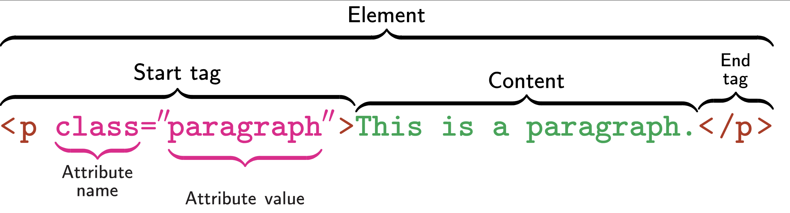



##  Week  

Today: `r TODAY_TOPIC`

. . . 

::: {.smaller}

- Communicating Results (`quarto`)  ✅
- `R` Basics  ✅
- Data Manipulation in `R`  ✅
- Data Visualization in `R`  ✅
- Getting Data into `R` ⬅️
  - Files and APIs ✅
  - Web Scraping ⬅️
  - Cleaning and Processing Text
- Statistical Modeling in `R`

:::


# Today

## Today

- Course Administration
- Warm-Up Exercise
- New Material
  - HTML Structure
  - Selectors
  - Parsing HTML with `rvest`
- Wrap-Up
  - Life Tip of the Day

# Course Administration

## Mini-Project #03

[MP#03](../mini/mini03.html) - `r get_mp_title(3)`

**Due `r get_mp_deadline(3)`**

. . . 

Topics covered: 

::: {.incremental .smaller}

- Data Import
  - Using the `tidycensus` Package
  - Static files
  - API Usage
- Data Maipulation and Visualization
  - Slicing and Dicing with `dplyr`
  - Spatial visualization (optional)
  
:::

. . . 

Submissions so far look great!


## Mini-Project #04

[MP#04](../mini/mini04.html) - `r get_mp_title(4)`

**Due `r get_mp_deadline(4)`**

. . . 

Topics covered: 

::: {.incremental .smaller}

- Data Import
  - HTTP Request Construction (Last Week)
  - HTML Scraping (Tabular) ⬅️ (Today)
- $t$-tests
- Putting Everything Together

:::


## Course Support

-   Synchronous - MW Office Hours 2x / week: 
    - **Wednesdays 5pm**: In Person
    - **Thursdays 5pm**: Zoom
-   Asynchronous: Piazza ($<45$ minute *average* response time)

<!--

## Large Files

Several of you have reported issues with `git` complaining about large files

> `git ls-tree -r -t -l --full-name HEAD | sort -n -k 4 | tail -n 10`

[SO on Removing Large Files](https://stackoverflow.com/questions/43762338/how-to-remove-file-from-git-history#52643437):

> `git filter-branch --index-filter 'git rm -rf --cached --ignore-unmatch data/**' HEAD`

⚠️This is dangerous! I can help with it after class.⚠️

-->

# Review Exercise

## API Exercise

The [Open Trivia Database](https://opentdb.com/)

- Use the API to build the question bank for a trivia night

See [this week's Lab](`r url_full`#review) for details

## Breakout Rooms {.scrollable}

```{r}
#| echo: false
BREAKOUT_TABLE
```


# Working with HTML 

## HTML

HTML - HyperText Markup Language - is the language used to write web pages

- We have avoided writing HTML directly, in favor of _Markdown_

. . . 

But you will have to read HTML

- In a web browser, right click and "View Source" on a page

## HTML Elements

HTML is written as a nested series of `elements`: 



## Important Elements

There are _many_ HTML elements; some important ones are: 

::: {.incremental .small}

- `body`: Body (the 'mean' of a page)
- `h1`, `h2`, ...: Headers
- `div`: Division (generic container)
- `p`: Paragraph (most text goes in these)
- `table`: Table (often how data is displayed)
- `ul`, `ol`: Lists (unordered and ordered)
- `li`: List Item (for both list types)
- `a`: Anchors (used for linking)

:::

## Important Elements

Other useful elements: 

- `script`: Javascript - the code that implements interactivity
- `style`: CSS - formatting and appearance

You won't use these directly, but they are _everywhere_

## HTML Element Selection

The SelectorGadget can be used to practice selecting elements on web pages

::: {.incremental .smaller}

- `#id` will select by ID ("name")
- `type` will select all elements of that type
- `.class` will select all elements with that class
- `[attribute]` will select elements with that attribute
- `[attribute="value"]` will select elements with that attribute and value
- `sel1 sel2` will select elements matching `sel2` that are _inside_ a `sel1`
  - *e.g.*, `tr .odd` will select the odd rows of a `gt` table
  
:::
  
## Advanced CSS Selectors

[CSS Selector Pseudo-classes](https://developer.mozilla.org/en-US/docs/Web/CSS/Guides/Selectors) can be used to implement more specific logic

::: {.incremental}

- `first-of-type` (*e.g.*, `table:first-of-type` gets the _first_ table)
- `nth-of-type` (*e.g.*, `h2:nth-of-type(2)` gets the _second_ `h2`)
- `not` (*e.g.*, `tr:not(.odd)` gets all table rows _without_ the `odd` class)

:::

## HTML Element Selection

From the pre-reading:

::: {.incremental}

1. [Star Wars](https://rvest.tidyverse.org/articles/starwars.html) movie titles
    -  `main h2`
2. [Baruch GPS](https://en.wikipedia.org/wiki/Baruch_College)
    - `.geo`
3. Wikipedia [CUNY Table](https://en.wikipedia.org/wiki/List_of_City_University_of_New_York_institutions)
    - `table` or `tbody`

:::

## HTML Anchors

_Anchors_ (`a` elements) are probably the most important part of HTML

. . . 

Confusingly, anchors are *both links and destinations*.

. . . 

Anchors can reference: 

::: {.incremental .small}

- Another page (`http://URL`)
- A particular part of another page (`http://URL#place`)
- A particular part of the same page (`#place`)

:::

. . . 

Can also use _relative_ paths for links within the same site

. . . 

::: {.smaller}

Quarto supports [cross-linking](https://quarto.org/docs/authoring/cross-references.html) with anchors: *e.g.* `../lab09.qmd#review` gives a link to this week's review

:::

## HTML Anchors

Incoming link anchor:

> `<a id="#fish"> Content </a>` 

Links to `http://page#fish` will go straight to that spot

. . . 

Outgoing link anchor: 

> `<a href="https://baruch.cuny.edu"> Baruch </a>` 

Clicking text `Baruch` will go to Baruch website

## HTML Tables

HTML Tables are often used for showing data: 

- `<table>` - Top level container
- `<thead>` and `<tbody>` - Separate header and body
- `<trow>` - Rows
- `<td>` - Table data (cells)

Can be much fancier - will see several examples in exercises

## rvest

The `rvest` package can be used to manipulate HTML in `R`: 

::: {.incremental .small}

- Get HTML by either `read_html` or `resp_body_html` if using `httr2`
- Select elements with `html_elements("selector")`
  - Same syntax as SelectorGadget
  - Use `html_element` if you only want **the first**
- Eventually need to extract content
  - `html_text` and `html_text2` (removes whitespace)
  - `html_attr` gets attribute values (*e.g.*, link targets)
  - `html_table` will attempt to parse a table automatically
  
:::
  
## Example

Using `httr2` to get the names of all 5 Mini-Projects

. . . 

```{r}
#| message: false
library(rvest)
read_html("https://michael-weylandt.com/STA9750/miniprojects.html") |>
    html_element("#mini-projects") |>
    html_elements("h4") |>
    html_text2()
```

## Breakout Exercise #01

Return to your breakout rooms for [Exercise #01](`r url_full`#ex01)

- Use `html_element()` to extract the course table
- Use `html_table()` to convert to a data frame

## JavaScript Websites

JavaScript is a great tool, but `R` doesn't know about it

::: {.incremental}

- What you see might not be what `R` sees
- Make sure to consider "raw" HTML 
- Often 'hijacks' important elements to add new features
  - Focus on _standard_ HTML elements

:::

## Breakout Exercise #02

Return to your breakout rooms for [Exercise #02](../labs/lab11.html#ex02)

- Finding a table in a more complex website
- Pulling out desired data
- Making a map of results (optional)

## read_html_live

`rvest` also provides tools for interacting with sites _as shown in the browser_

- `read_html_live()`

. . . 

::: {.smaller}

User interface is a bit different - we have to _load_ the page explicitly and 
interact with a persistent object:

```{r}
#| eval: false
wikipage <- read_html_live("https://en.wikipedia.org/wiki/List_of_City_University_of_New_York_institutions")
wikipage$view()
wikipage$html_elements(".jquery-tablesorter")
```

Should remind you of Python's `obj.method()` syntax

:::

. . . 

This is advanced, so don't worry too much about it until you need it


## Non-Tabular Data

Often, data will not be in a nice table

::: {.incremental}

- Need to _manually_ build a `data.frame`
- Build each data frame and 'combine'
  - `map |> list_rbind()` idiom
  - `DATA <- rbind(DATA, NEW_DATA)` idiom
  
:::

## Loops

Recall the basic structure of a loop in `R`: 

```{r}
#| eval: false
for(item in container){
    do_something_with(item)
}
```

. . . 

Accumulate data 

```{r}
#| eval: false
all_results <- tibble()
for(item in container){
    new_results <- do_something_with(item)
    new_tibble <- tibble(col1=new_results |> get_val1(), 
                         col2=new_results |> get_val2())
    all_results <- rbind(all_results, new_tibble)
}
```

## Example

Getting info about all pre-assignments

. . . 

```{r}
#| eval: false
library(rvest)

preassigns <- read_html("https://michael-weylandt.com/STA9750/preassignments.html") |> 
    html_element("#pre-assignments") |>
    html_elements("section")

pa_details <- tibble()
for(pa in preassigns){
    name        = pa |> html_element("h4") |> html_text2()
    description = pa |> html_elements("p:last-of-type") |>html_text2()
    
    pa_df <- tibble(name = name, description = description)
    
    pa_details <- rbind(pa_details, pa_df)
}

pa_details
```


## Example

Functional syntax is a bit more compact


```{r}
#| eval: false
library(rvest)

preassigns <- read_html("https://michael-weylandt.com/STA9750/preassignments.html") |> 
    html_element("#pre-assignments") |>
    html_elements("section")

parse_pa <- function(pa){
    name <- pa |> html_element("h4") |> html_text2()
    description <- pa |> html_elements("p:last-of-type") |>  html_text2()
    
    tibble(name = name, description = description)
}

pa_details <- preassigns |> map(parse_pa) |> list_rbind()

pa_details
```

## Example

When vectorization is possible (via `html_elements`) - even cleaner:

```{r}
#| eval: false
library(rvest)

preassigns <- read_html("https://michael-weylandt.com/STA9750/preassignments.html") |> 
    html_element("#pre-assignments") |>
    html_elements("section")

names <- preassigns |> html_elements("h4") |> html_text2()
descriptions <- preassigns |> html_elements("p:last-of-type") |>  html_text2()
    
pa_details <- tibble(name = names, description = descriptions)

pa_details
```

## Breakout Exercise #03

Return to your breakout rooms for [Exercise #03](`r url_full`#ex03)

- Examining a multi-page site
- Pulling out data from non-tabular elements

# Wrap Up

## Wrap Up 

Processing HTML in R

- HTML Structure
- HTML Selectors
- `html_table` and `<table>` elements
- HTML Anchors and Links

## Musical Treat

</br>



You might recognize the finale from [Fantasia 2000](https://www.youtube.com/watch?v=7EBy1lBXgtE)
