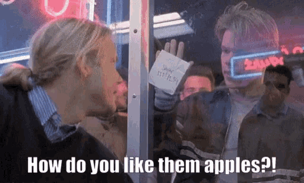
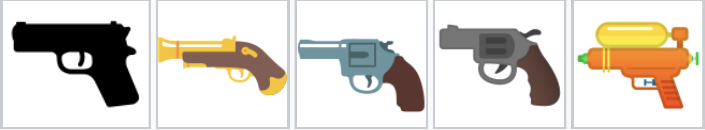



##  Week  

Today: `r TODAY_TOPIC`

. . . 

::: {.smaller}

- Communicating Results (`quarto`)  ✅
- `R` Basics  ✅
- Data Manipulation in `R`  ✅
- Data Visualization in `R`  ✅
- Getting Data into `R` ⬅️
  - Files and APIs ✅
  - Web Scraping ✅
  - Cleaning and Processing Text ⬅️
- Statistical Modeling in `R`

:::


# Today

## Today

- Course Administration
- Warm-Up Exercise
- New Material
  - Strings and Encodings
  - Regular Expressions
  - Text Manipulation
- Wrap-Up

# Course Administration

## Mini-Project #04

[MP#04](../mini/mini04.html) - `r get_mp_title(4)`

**Due `r get_mp_deadline(4)`**

. . . 

Topics covered: 

::: {.incremental .smaller}

- Data Import
  - HTTP Request Construction (Week 9)
  - Tabular HTML Scraping (Week 11)
- $t$-tests
- Putting Everything Together

:::



## Course Project

End of Semester Course Project: 

::: {.incremental}

- In-Class Final Presentations
  - **Next Week** (`r get_project_due_date("final-presentation")`)
- Individual Report: `r get_project_due_date("individual-report")`
- Group Report: `r get_project_due_date("group-report")`
- Peer Evaluations: `r get_project_due_date("final-peer")`

:::

See [detailed instructions](../project.qmd) for rubrics, expectations, *etc.*

# Review Exercise

## Apple Rankings

We're going to parse the page <https://applerankings.com> to find the best type of 
apples. See [this week's lab](`r url_full`#review) for details.

## Breakout Rooms {.scrollable}

```{r}
#| echo: false
BREAKOUT_TABLE
```

## 'em Apples

{width="70%"}

# Working with Strings

## Strings

In `R`, strings and characters are basically interchangeable

- Arbitrary "bits of text" that can be stored in a vector
- Don't normally need to think about encoding

. . . 

`stringr` provides basic tools for string manipulation (`str_` functions)

`stringi` provides advanced functionality

## String Handling

Easy to get 90% of the way correct - very hard to get 100% correct

Human language is _messy_ - choices are _culturally-specific_

. . . 

Unicode standard exists to make it easy (easier...) to do the right thing

## Unicode

Unicode is an attempt to standardize all human written language: 

- So hard!
- Moving target
- Don't implement yourself - use libraries

. . . 

Latest Unicode tables: [unicodeplus.com/](https://unicodeplus.com)

. . . 

_Encodings_ connect Unicode IDs with actual bits on your computer: `UTF-8` is
mainly back-compatible and should be your default


## Unicode Controversies

Pistol (`U+1F52B`) emoji: 

- Originally a (regular) gun, Apple lead the charge to a water pistol, now standard



## Unicode Controversies

Taco Controversy 🌮: 

- Taco Emoji [History](https://www.huffpost.com/entry/taco-bell-emoji-petition_n_6416798)
- Taco Emoji [Controversy](https://www.vice.com/en/article/the-brief-history-of-the-taco-emoji-now-has-a-happy-ending/)


## Unicode Failures

</br>



## Unicode+UTF-8 - Modern Standard

Best practices: 

- Use updated Unicode compliant libraries like `stringr`
- Use UTF-8 strings 
- If your data isn't UTF-8, make it UTF-8 ASAP

```{r}
#| eval: false
iconv(STRING, from="latin1", to="UTF-8")
```

## stringr

The *tidyverse* package `stringr` provides a tools for string manipulation: 

- All functions start with `str_`
- "Input" string is always first argument
- Reasonably vectorized

## stringr + dplyr

All `stringr` functions work well in `dplyr` pipelines ("vectorized"): 

```{r}
library(dplyr); library(stringr)
df <- data.frame(lower_letters = letters)
df |> mutate(upper_letters = str_to_upper(lower_letters))
```

## Substrings and String Splitting

```{r}
fruits <- c("apples and oranges and pears and bananas", 
            "pineapples and mangos and guavas")

stringr::str_split(fruits, " and ")
```

```{r}
stringr::str_split_fixed(fruits, "and", n=2)
```

See also `str_split_i` to get only one element of split

## Trimming Strings

Common to have excess whitespace around results: `str_trim`

. . . 

```{r}
split_fruits <- stringr::str_split(fruits, "and") |> list_c()
split_fruits
```

becomes 

```{r}
split_fruits |> str_trim()
```

## Sub-Strings

`str_sub` to get _substrings_:

```{r}
x <- "Baruch College, CUNY"
stringr::str_sub(x, end=6) # Includes endpoints
```

. . . 

```{r}
stringr::str_sub(x, start=-4) # Count from end
```

```{r}
x <- c("Baruch College, CUNY", "Brooklyn College, CUNY")
stringr::str_sub(x, end=-7) # Drop last _6_
```

## Regular Expressions

Working directly with characters is painful and hard to do
properly

. . . 

_Regular Expressions_ (`regex`) provide tools for specifying
patterns in strings: 

- Regular => following rules

## Regular Expression Tools

- Testing Regular Expressions Interactively: [regex101.com/](https://regex101.com/)
- Alternative [regexr.com/](https://regexr.com/)
- Automated Regular Expression Builder: [regex-generator](https://regex-generator.olafneumann.org) 
- AI Regexp Builder: [hregexgo.com/](https://www.regexgo.com/)

. . . 

LLMs are also very good at this _if_ you can specify what you want properly.

## Regex 101

A basic regex is just a pattern: 

- `a`: The regex `a` will match all strings with an `a`: 

```{r}
pets <- c("cat", "dog", "fish", "catfish")
str_detect(pets, "a")
```

. . . 

- Longer patterns are more precise: 

```{r}
pets <- c("cat", "dog", "fish", "catfish")
str_detect(pets, "fish")
```

## Replacement

`str_replace` will replace string with something else: 
  - `str_remove` will replace with nothing
  - Does first match (*cf* `str_{remove,replace}_all`)
  
```{r}
x <- c("123", "123,456", "123,456,789")
str_remove(x, ",")
str_remove_all(x, ",")
```

## Wildcard

The `.` character is a 'wildcard' and matches _anything_: 

```{r}
pets <- c("cat", "dog", "fish", "catfish")
str_detect(pets, ".fish")
```

(You might have seen a similar usage using _formulas_)

## Alternatives

Alternatives can be expressed using a `|`: 

```{r}
pets <- c("cat", "dog", "fish", "catfish")
str_detect(pets, "a|o")
```

. . . 

For longer patterns, wrap in parentheses

```{r}
pets <- c("cat", "dog", "fish", "catfish")
str_detect(pets, "(dog|fish)")
```

## Ranges

Sometimes we might want to match a wide range of characters; *e.g.* digits

Alternatives are painful: `(0|1|2|3|4|5|6|7|8|9)`

. . . 

Can use a `range` notion instead: `[0-9]`

```{r}
pets <- c("1 cat", "a dog", "3 fish", "two elephants")
str_detect(pets, "[0-9]")
```

## Ranges

Useful ranges: 

- `[A-Z]`: Uppercase letters
- `[a-z]`: Lowercase letters
- `[0-9]`: Digits

. . . 

Can also 'hard code' a range by listing all elements: 

- `[0123456789]`
- `[aeiou]`


## Ranges

Some useful ranges are hard-coded: 

::: {.smaller}

- `[:alpha:]`
- `[:lower:]`
- `[:upper:]`
- `[:digit:]`
- `[:alnum:]`
- `[:punct:]`
- `[:space:]`

:::

I like these - quite clear: 

```{r}
pets <- c("1 cat", "a dog", "3 fish", "two elephants")
str_detect(pets, "[:digit:]")
```

## Quantifiers

Quantifiers (multiple matches): 

- `.{a, b}`: anywhere from `a` to `b` copies (inclusive)
- `.{, b}`: no more than `b` copies
- `.{a,}`: at least `a` copies
- `.?`: zero-or-one, same as `.{0,1}`
- `.*`: zero-or-more, same as `.{0,}`
- `.+`: one-or-more, same as `{1,}`

## Quantifiers

Wildcard match _optional_:

```{r}
pets <- c("cat", "dog", "fish", "catfish")
str_detect(pets, ".?fish")
```

. . . 

Strings with numbers: 

```{r}
pets <- c("1 cat", "a dogs", "3 fish", "two birds")
str_detect(pets, "[:digit:]")
```

. . . 

Numbers 10 or greater: 

```{r}
pets <- c("1 cat", "3 dogs", "10 fish", "20 birds")
str_detect(pets, "[:digit:]{2,}")
```

## Regular Expression Practice

With your breakout group, it's time for some [Regular Expression
Practice](../labs/lab12.html#regex)

## Start and End Anchors

Anchors let us refer to the start and end of a string: 

- `^`: start
- `$`: end

. . . 

Things starting with a number:

```{r}
songs <- c("Mambo No 5", "99 Red Balloons", "5 Years Time")
str_subset(songs, "^[:digit:]")
```


## Extracting Matches

Often, we use regex to pull our part of a string: 

::: {.incremental}

- `str_detect` is there a 'fit'?
- `str_extract` extract the _whole_ 'fit'
- `str_extract(group=)` and `str_match` extract specific groups

:::

. . . 

Specify groups with parentheses

```{r}
"[:digit:]{3}-([:digit:]{3})-[:digit:]{4}"
```

will extract `"312"` when applied to `"646-312-3257"`

## Extracting Matches

`str_detect` - is there a match?

```{r}
x <- "Baruch College, CUNY is a wonderful place to work!"
stringr::str_detect(x, "(.*), CUNY")
```

. . . 

`str_extract` - get the matched substring

```{r}
stringr::str_extract(x, "(.*), CUNY")
```

. . . 

`str_match` - use capture groups

```{r}
stringr::str_extract(x, "(.*), CUNY", group=1)
stringr::str_match(x, "(.*), CUNY")
```

## Extracting Matches

Very useful for pulling numbers out of text: 

```{r}
x <- c("123", "456 (estimated)", "Approximately 7.89")
str_extract(x, "[.[:digit:]]+")
```

## Extracting Matches

`str_match(group=)` is useful for complex data extraction. 

```{r}
x <- c("Michael Weylandt teaches STA9750", 
       "Kamiar Rad teaches STA9891")
pattern <- c("(.*) teaches (.*)")
stringr::str_extract(x, pattern, group=1)
stringr::str_extract(x, pattern, group=2)
```

. . . 

Also allows named groups - really helpful!

```{r}
pattern <- c("(?<instructor>.*) teaches (?<course>.*) on (?<weekday>.*)")
stringr::str_match(x, pattern) |> as.data.frame()
```


## Exclusion

```{r}
x <- c("10 blue fish", "three wet goats")
stringr::str_detect(x, "[^0123456789]")
```

Not quite what we want

. . . 

`str_detect` has a `negate` option:

```{r}
stringr::str_detect(x, "[0-9]", negate=TRUE)
```

## Homoglyphs

```{r}
x <- c("Η", "H")
tolower(x)
```

Why?

. . . 

```{r}
uni_info <- Vectorize(\(x) Unicode::u_char_name(utf8ToInt(x)), "x")
uni_info(x)
```

## Homoglyphs

Particularly nasty with dashes - lean on `[:punct::]` where possible.

```{r}
x <- c("Em Dash —", "En Dash –", "Hyphen ‐")
stringr::str_remove(x, "[:punct:]") # Works
stringr::str_remove(x, "-")  # Keyboard minus = Fail
```

## Why stringr?

Base `R` has its own set of regular expression functions (`grep` and friends)

. . . 

`stringr` does the same thing, but with a more consistent 
interface. 

Conversion table [online](https://stringr.tidyverse.org/articles/from-base.html)

## Regex in Scraping

Let's practice using these functions in a _web-scraping_ context. 

. . . 

Follow [the lab](`r url_full`#quotes) to practice scraping
<https://quotes.toscrape.com> with your breakout group

. . . 

Items to practice: 

- String detection (does this quote mention X)
- String manipulation (longest, shortest, *etc.*)
- Removing punctuation (`str_remove_all`)

## Regex + Scraping

Regular expressions are incredibly useful when converting HTML text to workable
data: 

- Extract numbers
- Extract relevant parts of strings

## Regex + Scraping

Common paradigm: `html_text2() |> str_remove_all() |> as.numeric()`

```{r}
prices <- c("8.25", "$1,000", "500 USD", "$12,345.67 (Estimate)")
prices |> str_remove_all("[^.[:digit:]]") |> as.numeric()
```

Here, `[^.[:digit:]]` means anything (`[]`) that is not (`^`) a period or a digit.

## Regex + Scraping

Another common paradigm is to extract structured text into a data frame when
`html_table` fails

```{r}
x <- "Adelie female 200g
Gentoo Male 500g
Chinstrap Female 1000g"

str_split(x, "\\n", simplify=TRUE) |> 
    str_match("(?<species>.*) (?<sex>.*) (?<weight>\\d+)g") |> 
    as.data.frame() |>
    select(-V1) |>
    mutate(sex = if_else(str_detect(sex, "[Ff]"), "female", "male"))
```

## Regex + Scraping

Can also be used to manipulate strings within a data frame: 

```{r}
x <- tribble(
    ~enrollment, ~course,
    50, "STA 9750",
    20, "STA 9890"
)

x |> mutate(dept = str_extract(course, "([:alpha:]{3}) ([:digit:]{4})", group=1),
            numb = str_extract(course, "([:alpha:]{3}) ([:digit:]{4})", group=2))
```


## Cocktail Scraping

With your breakout group, it's time to finish the [cocktail scraping 
exercise🍸](`r url_full`#cocktails_finish)

. . .

Aim: Download all recipes from <https://cocktails.hadley.nz/>

. . . 

Recall from Last Time: 

::: {.small}

1) Make a mental map of site & Identify Selectors
2) Develop a strategy to get all pages
3) Function to pull out each recipe
4) Function to parse earch recipe into a data frame
5) Put it all together

:::


# Wrap Up

## Wrap Up 

Processing Strings in R

- Encoding and Unicode
- Regular Expressions
- String Manipulations
- Capturing with Regex



